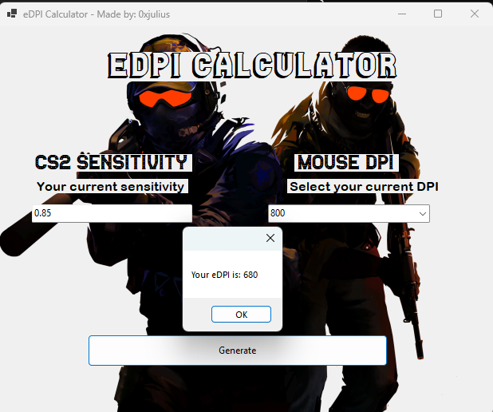

# Simple CS2/esports mouse eDPI calculator made with C#
eDPI stands for "effective Dots Per Inch." It is a metric used primarily in the gaming community to quantify a player's sensitivity settings in relation to their mouse DPI (dots per inch) setting. Understanding eDPI helps players determine how sensitive their mouse is when they move it, which can significantly impact their aiming and overall performance in games.

# Importance in Gaming
1. Consistency: Knowing your eDPI helps maintain consistent performance across different games or setups.
2. Aiming Precision: Players often adjust their eDPI for better control and precision in aiming, especially in first-person shooters (FPS).
3. Personal Preference: Different players prefer different eDPI values based on their play style, so it can be a way to customize the gaming experience.
4. Comparison with Professionals: Comparing your eDPI to that of professional players can provide valuable insights into effective sensitivity settings. Many pro players have optimized their settings for peak performance, and understanding their eDPI can help you evaluate your own performance and make adjustments as needed.
# Conclusion
In conclusion, eDPI is an essential metric for gamers, particularly in competitive settings, as it enables them to refine their settings for peak performance. By analyzing eDPI, players can not only enhance their own gameplay but also gain valuable insights by learning from the best in the industry.

# Key Learnings for this small project

1. C# and WinForms:
Developed a solid understanding of Windows Forms applications, including creating forms, adding controls, and handling events.

2. File Handling:
Learned to load resources like images and audio files dynamically, enhancing user experience.

3. Audio Playback:
Gained experience in using NAudio to manage audio playback, including volume control and playback state.

4. User Input Validation:
Implemented input validation and error handling to ensure proper user input and enhance application stability.

6. Optimizing Builds:
Understood the difference between debug and release builds, optimizing applications for performance and size.

7. Version Control:
Gained experience with Git for version control and using GitHub for project collaboration and sharing.

8. Project Management:
Learned to organize project files effectively and manage dependencies needed for application execution.

9. UI Design:
Developed skills in creating user-friendly interfaces and responsive elements based on user interactions.

10. Deployment Practices:
Understood how to prepare applications for distribution, ensuring they run smoothly outside the development environment.

11. Problem-Solving:
Enhanced debugging skills and learned to seek help from documentation and online resources.
